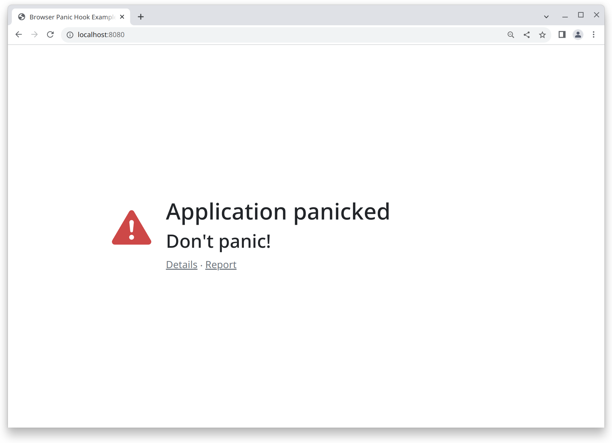

# Browser Panic Hook

[](https://github.com/ctron/browser-panic-hook/actions?query=workflow%3A%22CI%22)
[](https://github.com/ctron/browser-panic-hook/releases)
[](https://crates.io/crates/browser-panic-hook)
[](https://docs.rs/browser-panic-hook)

A go-to panic handler for WebAssembly based Rust application is [console_error_panic_hook](https://github.com/rustwasm/console_error_panic_hook), which does the job, but isn't really end user-friendly.

In the case of running the WebAssembly application as a frontend application, we do have the browser which can help
interacting with the user, so why not leverage it.

That is what this crate does, failing in style:



## Presentation

The panic is also always still logged to the console as a first step. As it might happen that running the panic
handler might run into trouble as well.

Next, it depends on what presentation mode you register. There is a `Basic` one, which takes over the body of the
document and renders some simple HTML structure, including some CSS class names. In combination with an existing
stylesheet, this may already be enough.

The `CustomBody` mode allow to provide a function, which renders the full body. This can be used to create more
customized output for frameworks like PatternFly or Bootstrap.

Everything boils down to a trait (`PresentationMode`), for which you can also provide a custom implementation.

Just note, your application is already panicking, so you should try to keep it simple, or rely on some basic
browser functionality.

## Usage

In any case, you need to add this crate a dependency to your project, and register the panic handler. Registering
can be as easy as:

```rust
pub fn main() -> Result<(), JsValue> {
    browser_panic_hook::set_once_default();

    // run your application ...
    Ok(())
}
```

You can also use a more customized variant:

```rust
pub fn main() -> Result<(), JsValue> { 
    browser_panic_hook::set_once(|| {
        browser_panic_hook::CustomBody(Box::new(|details| {
            // render new body
            format!("…")
        }))
    });
 
    // run your application ...
    Ok(())
}
```

More complete examples can be found in the [examples](examples) folder.

## Yew

Yew already sets a default panic hook. This can be overridden using:

```rust
pub fn main() -> Result<(), JsValue> {
    // provide a custom panic hook
    yew::set_custom_panic_hook(Basic.into_panic_hook());
    // run the application
    yew::Renderer::<app::Application>::new().render();
    Ok(())
}
```

## Future improvements

Additional improvements could be done, like:

* [ ] Call a diagnostic endpoint with the panic information
* [ ] Create a mode which overlays instead of replaces the HTML body
* [ ] Allow adding additional, application specific, HTML (like "click here to report the error") 
* [ ] For sure some more …
